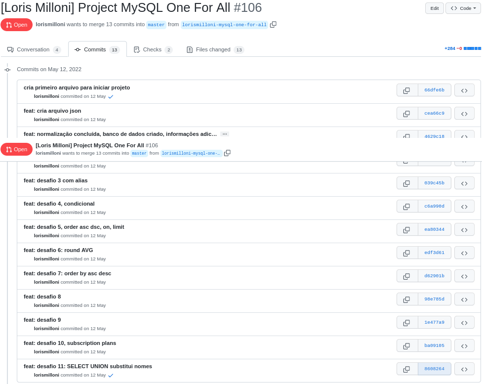
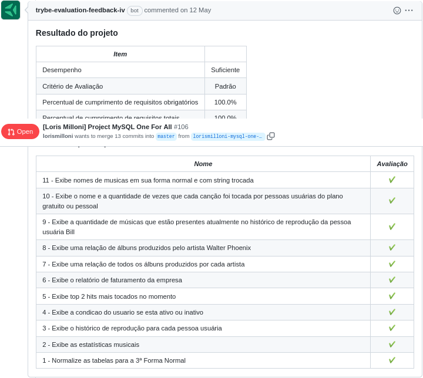

# studies-backend-mySQL-3NF
Made in **12/05/2022**.

## In this Trybe Course assignment I was learning how to manipulate a database and also how to normalize a table to avoid data duplication.
#### The third normal form (3NF) is a database schema design for relational databases.
 

#### Here is a code snippet:

 ```mysql
    SELECT 
        a.name AS usuario,
        COUNT(b.user_id) AS qtde_musicas_ouvidas,
        ROUND(SUM(seconds_length/60), 2) AS total_minutos
    FROM SpotifyClone.playback_history b
    INNER JOIN SpotifyClone.users a ON b.user_id = a.id
    INNER JOIN SpotifyClone.songs c ON c.id = b.song_id
    GROUP BY b.user_id
    ORDER BY usuario
    -- a = name e id from users
    -- b = playback history infos
    -- c = songs infos
 ```

#### Trybe has a private repository with files that can't be shared. So here is my commit history print:


#### Here is the Trybe Evaluator

